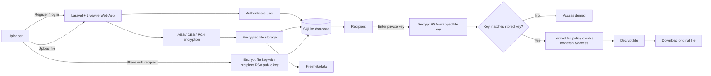
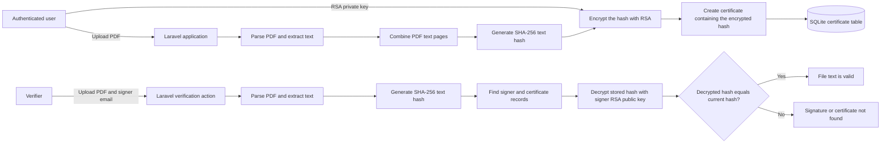

# SIMPENAN Workflow Diagrams

## Main System Flow

```mermaid
flowchart LR
    U1["Uploader"] -->|Register / log in| WEB["Laravel + Livewire Web App"]
    WEB --> AUTH["Authenticate user"]
    AUTH --> DB[("SQLite database")]

    U1 -->|Upload file| WEB
    WEB --> ENC["AES / DES / RC4 encryption"]
    ENC --> STORE["Encrypted file storage"]
    STORE --> DB
    STORE --> UFILE["File metadata"]

    U1 -->|Share with recipient| RSA1["Encrypt file key with recipient RSA public key"]
    RSA1 --> DB
    DB --> U2["Recipient"]

    U2 -->|Enter private key| RSA2["Decrypt RSA-wrapped file key"]
    RSA2 --> CHECK{"Key matches stored key?"}

    CHECK -->|No| DENIED["Access denied"]
    CHECK -->|Yes| AUTHZ["Laravel file policy checks ownership/access"]
    AUTHZ --> DECRYPT["Decrypt file"]
    DECRYPT --> DOWNLOAD["Download original file"]
```

## PDF Signing Flow

```mermaid
flowchart LR
    USER["Authenticated user"] -->|Upload PDF| WEB["Laravel application"]
    WEB --> PARSER["Parse PDF and extract text"]
    PARSER --> CONTENT["Combine PDF text pages"]
    CONTENT --> HASH["Generate SHA-256 text hash"]
    USER -->|RSA private key| SIGN["Encrypt the hash with RSA"]
    HASH --> SIGN
    SIGN --> CERT["Create certificate containing the encrypted hash"]
    CERT --> DB[("SQLite certificate table")]

    VERIFY["Verifier"] -->|Upload PDF and signer email| CHECKWEB["Laravel verification action"]
    CHECKWEB --> CHECKPARSER["Parse PDF and extract text"]
    CHECKPARSER --> CHECKHASH["Generate SHA-256 text hash"]
    CHECKHASH --> FETCH["Find signer and certificate records"]
    FETCH --> RSA["Decrypt stored hash with signer RSA public key"]
    RSA --> MATCH{"Decrypted hash equals current hash?"}
    MATCH -->|Yes| VALID["File text is valid"]
    MATCH -->|No| INVALID["Signature or certificate not found"]
```
